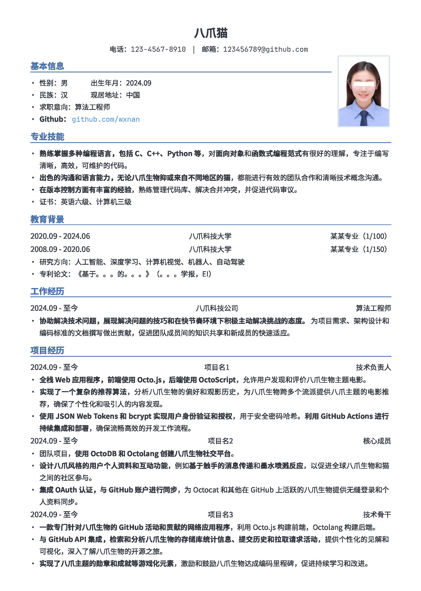
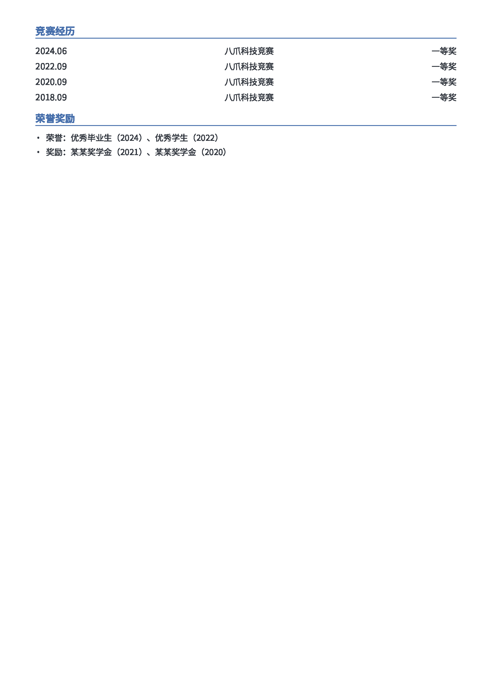
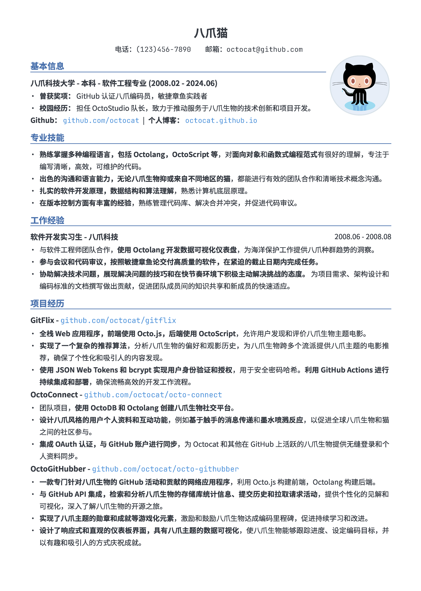

# resume
Resume template，简历模板，markdown版本和word版本，支持 VS Code 编辑

## 预览

- 模板1

<div align="center">
<div>

</div>
</div>

<div align="center">
<div>

</div>
</div>

- 模板2

<div align="center">
<div>

</div>
</div>

## 使用说明

### 路径说明

- 风格：修改 .vscode 文件夹下的 settings.json 文件，可选择不同的 markdown.styles
- 字体：字体文件在 ttf 文件夹下，修改 css 文件中字体路径，可选择不同的字体
- 头像：将 markdown\img\avatar.jpg 替换为自己的头像


### VS Code 编辑

1. 下载 
```shell
git clone https://github.com/wxnan/resume.git
```
2. 在 VSCode 中打开该文件夹，并安装插件 [Markdown PDF](https://marketplace.visualstudio.com/items?itemName=yzane.markdown-pdf)。
3. 打开模版文件 template.md 进行内容编辑，右上角点击 Open Preview 图标可进行实时预览。右键选择 Markdown PDF - Export (pdf) 即可导出 PDF 文件。

需要注意，VSCode 中安装的其他插件可能会影响预览显示效果，若预览效果与生成 PDF 中效果不一致，请检查是否有插件影响。

### word 版本

- 下载直接用 office 或 WPS 进行编辑。
- **注**：部分 docx 文件为 PDF 转 word。

## 参考

- [LapisCV](https://github.com/BingyanStudio/LapisCV)
- [AI-Job-Resume](https://kkgithub.com/amusi/AI-Job-Resume)