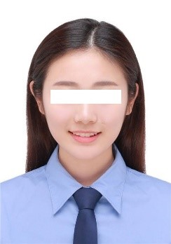

# 八爪猫

> 电话：`123-4567-8910`&emsp;|&emsp;邮箱：`123456789@github.com`

## 基本信息

- 性别：男 &emsp;&emsp;&emsp;出生年月：2024.09
- 民族：汉 &emsp;&emsp;&emsp;现居地址：中国
- 求职意向：算法工程师
- **Github：** [github.com/wxnan](https://github.com/wxnan)

## 专业技能

- **熟练掌握多种编程语言，包括 C、C++、Python 等**，对**面向对象**和**函数式编程范式**有很好的理解，专注于编写清晰，高效，可维护的代码。
- **出色的沟通和语言能力，无论八爪生物抑或来自不同地区的猫**，都能进行有效的团队合作和清晰技术概念沟通。
- **在版本控制方面有丰富的经验**，熟练管理代码库、解决合并冲突，并促进代码审议。
- 证书：英语六级、计算机三级

## 教育背景

    <h3 style="font-weight: normal;">2020.09 - 2024.06</h3>
    
八爪科技大学

    某某专业（1/100）

    <h3 style="font-weight: normal;">2008.09 - 2020.06</h3>
    
八爪科技大学

    某某专业（1/150）

- 研究方向：人工智能、深度学习、计算机视觉、机器人、自动驾驶
- 专利论文：《基于。。。的。。。》（。。。学报，EI）

## 工作经历

    <h3 style="font-weight: normal;">2024.09 - 至今</h3>
    
八爪科技公司

    算法工程师

- **协助解决技术问题，展现解决问题的技巧和在快节奏环境下积极主动解决挑战的态度。**
  为项目需求、架构设计和编码标准的文档撰写做出贡献，促进团队成员间的知识共享和新成员的快速适应。

## 项目经历

    <h3 style="font-weight: normal;">2024.09 - 至今</h3>
    
项目名1

    技术负责人

- **全栈 Web 应用程序，前端使用 Octo.js，后端使用 OctoScript**，允许用户发现和评价八爪生物主题电影。
- **实现了一个复杂的推荐算法**，分析八爪生物的偏好和观影历史，为八爪生物跨多个流派提供八爪主题的电影推荐，确保了个性化和吸引人的内容发现。
- **使用 JSON Web Tokens 和 bcrypt 实现用户身份验证和授权**，用于安全密码哈希。**利用 GitHub Actions 进行持续集成和部署**，确保流畅高效的开发工作流程。

    <h3 style="font-weight: normal;">2024.09 - 至今</h3>
    
项目名2

    核心成员

- 团队项目，**使用 OctoDB 和 Octolang 创建八爪生物社交平台**。
- **设计八爪风格的用户个人资料和互动功能**，例如**基于触手的消息传递**和**墨水喷溅反应**，以促进全球八爪生物和猫之间的社区参与。
- **集成 OAuth 认证，与 GitHub 账户进行同步**，为 Octocat 和其他在 GitHub 上活跃的八爪生物提供无缝登录和个人资料同步。

    <h3 style="font-weight: normal;">2024.09 - 至今</h3>
    
项目名3

    技术骨干

- **一款专门针对八爪生物的 GitHub 活动和贡献的网络应用程序**，利用 Octo.js 构建前端，Octolang 构建后端。
- **与 GitHub API 集成，检索和分析八爪生物的存储库统计信息、提交历史和拉取请求活动**，提供个性化的见解和可视化，深入了解八爪生物的开源之旅。
- **实现了八爪主题的勋章和成就等游戏化元素**，激励和鼓励八爪生物达成编码里程碑，促进持续学习和改进。

## 竞赛经历

    <h3 style="font-weight: normal;">2024.06</h3>
    
八爪科技竞赛

    一等奖

    <h3 style="font-weight: normal;">2022.09</h3>
    
八爪科技竞赛

    一等奖

    <h3 style="font-weight: normal;">2020.09</h3>
    
八爪科技竞赛

    一等奖

    <h3 style="font-weight: normal;">2018.09</h3>
    
八爪科技竞赛

    一等奖

## 荣誉奖励

- 荣誉：优秀毕业生（2024）、优秀学生（2022）
- 奖励：某某奖学金（2021）、某某奖学金（2020）
